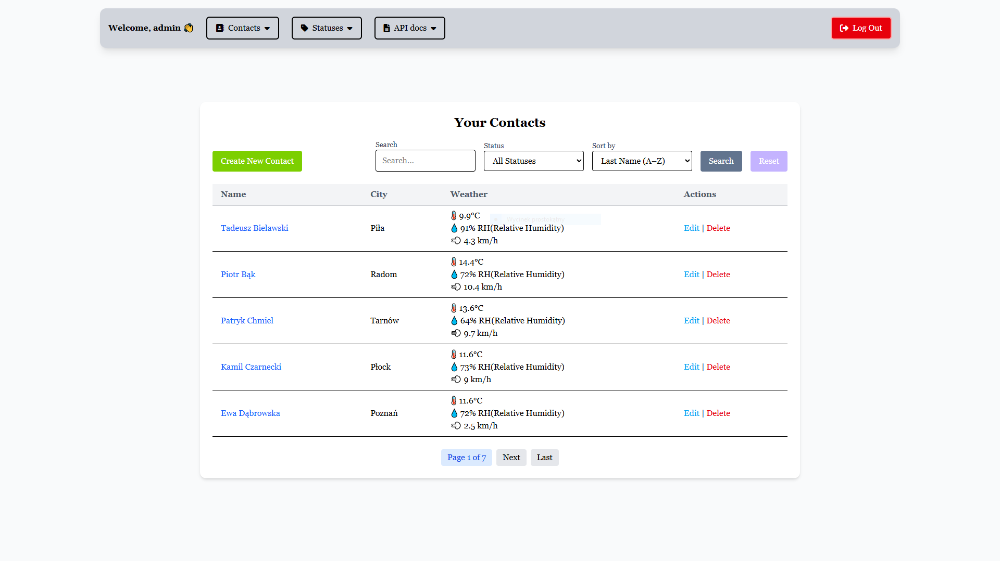
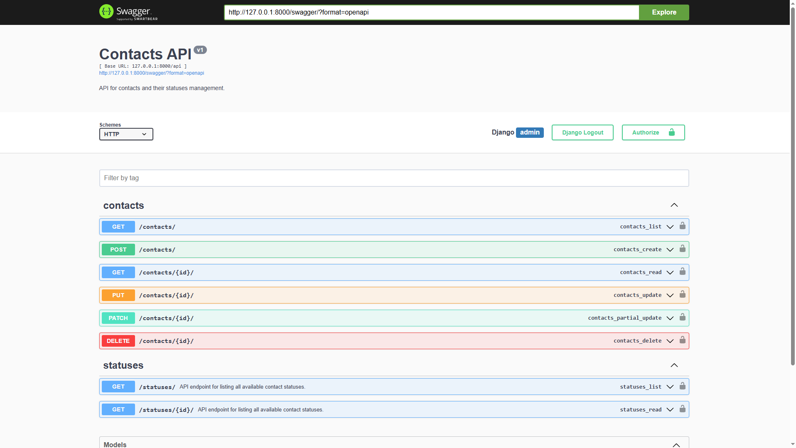
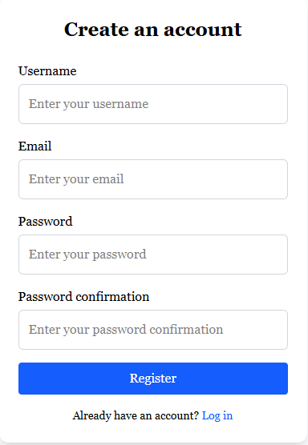
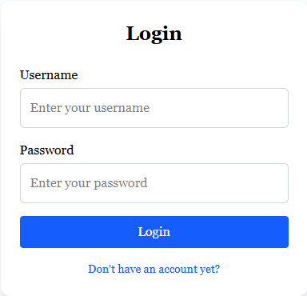
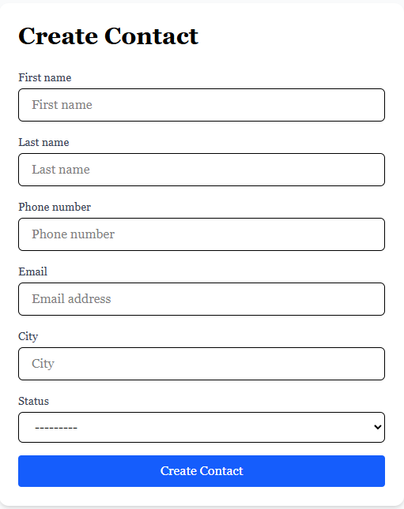
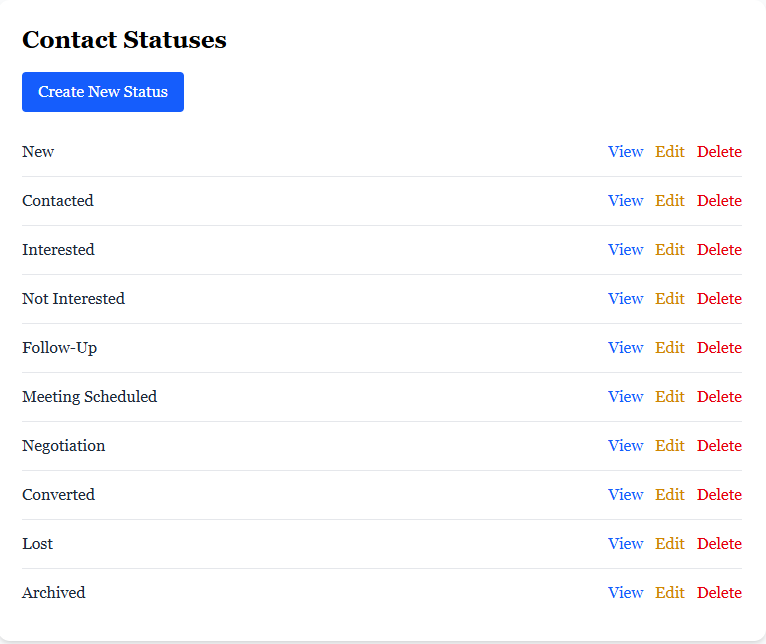

# Contact Management App


A Django-based contact management application with a RESTful API and Tailwind CSS styling.

## 🖼️ Screenshots

| **Home Page** | **API Docs** |
|---------------|--------------|
|  |  |
| **Register Form** | **Login Form** |
|  |  |
| **Create Contact** | **Contact Statuses List** |
|  |  |

<details>
<summary><strong>## Features</strong></summary>

### Core Features
- Complete CRUD operations for contacts (Create, Read, Update, Delete)
- RESTful API with Django REST Framework
- Responsive UI using Tailwind CSS
- Contact filtering and searching capabilities
- Sorting and ordering of contacts
- Status management for contacts

### API Features
- Comprehensive RESTful API endpoints
- Filtering by status, city, and other fields
- Full-text search across contact fields
- Ordering and pagination
- Proper error handling and status codes
- API documentation with Swagger/OpenAPI

### UI Features
- Design with Tailwind CSS

### Development Features
- Comprehensive test suite
- Code quality tools integration
- Dependency management with uv
- Environment-based configuration
</details>

<details>
<summary><strong>## Tools and Requirements</strong></summary>

### Core Technologies
- Python 3.13+
- Django 5.2
- Django REST Framework 3.16.0
- Tailwind CSS (via django-tailwind 4.0.1)
- SQLite (development)

### Package Management
- uv (fast Python package installer)
- pip

### Frontend
- Tailwind CSS
- HTML/CSS/JavaScript
- Node.js and npm (for Tailwind compilation)

### Development Tools
- Black (code formatter)
- isort (import sorter)
- Ruff (linter)
- pre-commit (git hooks)
- Factory Boy and Faker (test data generation)

### Documentation
- drf-yasg (Swagger/OpenAPI generator)
- Markdown

### Testing
- Django Test Framework
- Factory Boy
- Faker

</details>

## 📂 Project Structure

```
contact_management/
├── api/                    # API app with views, serializers, and tests
├── contacts/               # Core contacts app with models
├── contact_management/     # Project settings and configuration
├── staticfiles/            # Compiled static files
├── templates/              # HTML templates
├── testing/                # Test utilities and factories
├── theme/                  # Tailwind CSS configuration
├── manage.py               # Django management script
├── requirements.txt        # Project dependencies
└── pyproject.toml          # Project configuration
```

<details>
<summary><strong>## Setup Instructions</strong></summary>

<details>
<summary><strong>### Development Environment</strong></summary>

1. Clone the repository:
   ```bash
   git clone https://github.com/Samekmat/ContactManagement.git
   cd contact_management
   ```

2. Create and activate a virtual environment:
   ```bash
   python -m venv .venv

   # Windows
   .\.venv\Scripts\activate

   # macOS/Linux
   source .venv/bin/activate
   ```

3. Install dependencies:

   Using pip:
   ```bash
   pip install -r requirements.txt
   ```

   Using uv (recommended):
   ```bash
   pip install uv
   uv pip install -r requirements.txt
   ```

4. Create a `.env` file based on `.env.dist` and configure your environment variables.

5. Run migrations:
   ```bash
   python manage.py migrate
   ```

6. (Optional) Collect static files if testing with `DEBUG=False`:
   ```bash
   python manage.py collectstatic
   ```

7. Create a superuser:
   ```bash
   python manage.py createsuperuser
   ```

8. Run the development server:
   ```bash
   python manage.py runserver
   ```

9. Access the application at http://127.0.0.1:8000/
</details>

<details>
<summary><strong>### Production Environment</strong></summary>

> ⚠️ For demo or testing only. In real deployment, use Gunicorn + Nginx or similar.

1. Clone the repository:
   ```bash
   git clone https://github.com/Samekmat/ContactManagement.git
   cd contact_management
   ```

2. Create and activate a virtual environment:
   ```bash
   python -m venv .venv

   # Windows
   .\.venv\Scripts\activate

   # macOS/Linux
   source .venv/bin/activate
   ```

3. Install dependencies:
   ```bash
   pip install uv
   uv pip install -r requirements.txt
   ```

4. Create a `.env` file and configure production settings:

   Example:
   ```env
   DEBUG=False
   SECRET_KEY=your-secure-secret
   ALLOWED_HOSTS=yourdomain.com,127.0.0.1
   DATABASE_URL=your-production-database-url
   ```

5. Run migrations:
   ```bash
   python manage.py migrate
   ```

6. Collect static files:
   ```bash
   python manage.py collectstatic
   ```

7. (Optional) Serve static files (for preview/testing only):
   ```bash
   python -m http.server 8001
   ```

</details>
</details>

<details>
<summary><strong>## Running Tests</strong></summary>

### Python Tests
```bash
python manage.py test
```

### JavaScript Tests
To run the JavaScript tests located in the `contacts/tests/js` directory:

1. Navigate to the JavaScript tests directory:
   ```bash
   cd contacts/tests/js
   ```

2. Install the dependencies (first time only):
   ```bash
   npm install
   ```

3. Run all tests:
   ```bash
   npm test
   ```

</details>

## 📃 API Documentation

The API is built using Django REST Framework and provides endpoints for managing contacts.

### API Endpoints

| Endpoint | Method | Description |
|----------|--------|-------------|
| `/api/contacts/` | GET | List all contacts |
| `/api/contacts/` | POST | Create a new contact |
| `/api/contacts/{id}/` | GET | Retrieve a specific contact |
| `/api/contacts/{id}/` | PUT | Update a specific contact |
| `/api/contacts/{id}/` | PATCH | Partially update a specific contact |
| `/api/contacts/{id}/` | DELETE | Delete a specific contact |
| `/api/contact-statuses/` | GET | List all contact statuses |
| `/api/contact-statuses/{id}/` | GET | Retrieve a specific contact status |

<details>
<summary><strong>### Example API Requests and Responses</strong></summary>

#### List Contacts

Request:
```http
GET /api/contacts/
```

Response:
```json
{
  "count": 2,
  "next": null,
  "previous": null,
  "results": [
    {
      "id": 1,
      "first_name": "John",
      "last_name": "Doe",
      "phone_number": "123456789",
      "email": "john@example.com",
      "city": "New York",
      "status": {
        "id": 1,
        "name": "Active"
      }
    },
    {
      "id": 2,
      "first_name": "Jane",
      "last_name": "Smith",
      "phone_number": "987654321",
      "email": "jane@example.com",
      "city": "Los Angeles",
      "status": {
        "id": 1,
        "name": "Active"
      }
    }
  ]
}
```

#### Create Contact

Request:
```http
POST /api/contacts/
Content-Type: application/json

{
  "first_name": "Alice",
  "last_name": "Johnson",
  "phone_number": "555123456",
  "email": "alice@example.com",
  "city": "Chicago",
  "status_id": 1
}
```

Response:
```json
{
  "id": 3,
  "first_name": "Alice",
  "last_name": "Johnson",
  "phone_number": "555123456",
  "email": "alice@example.com",
  "city": "Chicago",
  "status": {
    "id": 1,
    "name": "Active"
  }
}
```

#### Update Contact

Request:
```http
PUT /api/contacts/1/
Content-Type: application/json

{
  "first_name": "John",
  "last_name": "Doe",
  "phone_number": "123456789",
  "email": "john@example.com",
  "city": "Boston",
  "status_id": 2
}
```

Response:
```json
{
  "id": 1,
  "first_name": "John",
  "last_name": "Doe",
  "phone_number": "123456789",
  "email": "john@example.com",
  "city": "Boston",
  "status": {
    "id": 2,
    "name": "Archived"
  }
}
```

#### Filtering and Searching

```http
GET /api/contacts/?status=1
GET /api/contacts/?city=New%20York
GET /api/contacts/?search=john
```

#### Ordering

```http
GET /api/contacts/?ordering=last_name
GET /api/contacts/?ordering=-last_name
```

#### Contact Status Endpoints

```http
GET /api/contact-statuses/
GET /api/contact-statuses/1/
```

</details>

## 🔒 Security and Audit

- Code quality tools: `black`, `isort`, `ruff`, `bandit`, `pip-audit`
- Pre-commit hooks ensure linting and formatting before commits
- All dependencies are scanned for vulnerabilities
- Uses `.env` files for secure secret management
